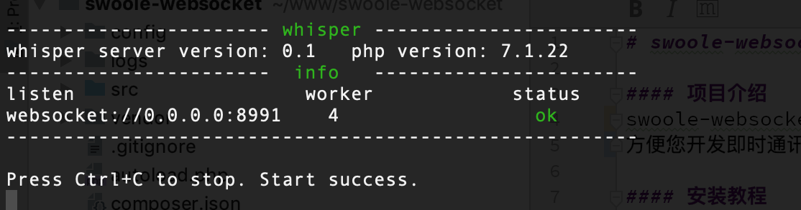
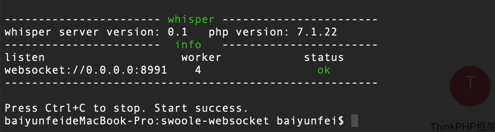
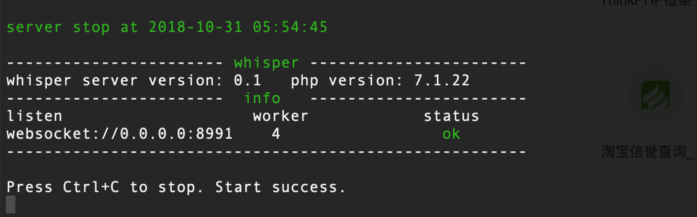
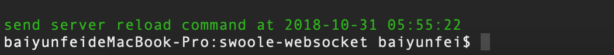
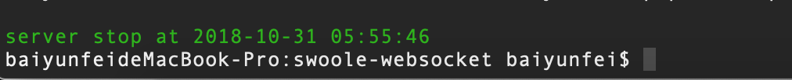
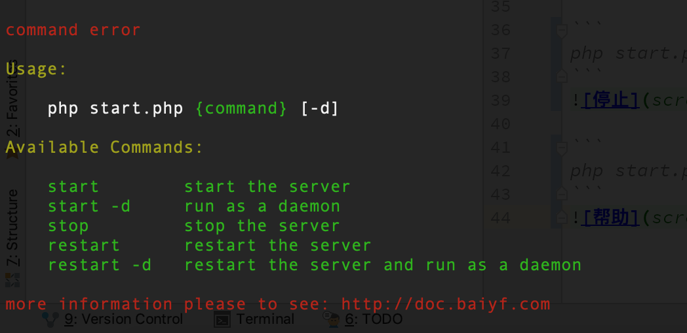

# swoole-websocket

#### 项目介绍
swoole-websocket库   
方便您开发即时通讯项目

#### 安装教程

1. 拥有php环境且版本高于 7.0
2. 安装swoole扩展，建议 4.x


#### 使用说明

进入项目目录，运行  
```
php start.php start
```
 

```
php start.php start -d
```
 

```
php start.php restart
```
 

```
php start.php restart -d
```
 

```
php start.php stop
```
 

```
php start.php
```
 